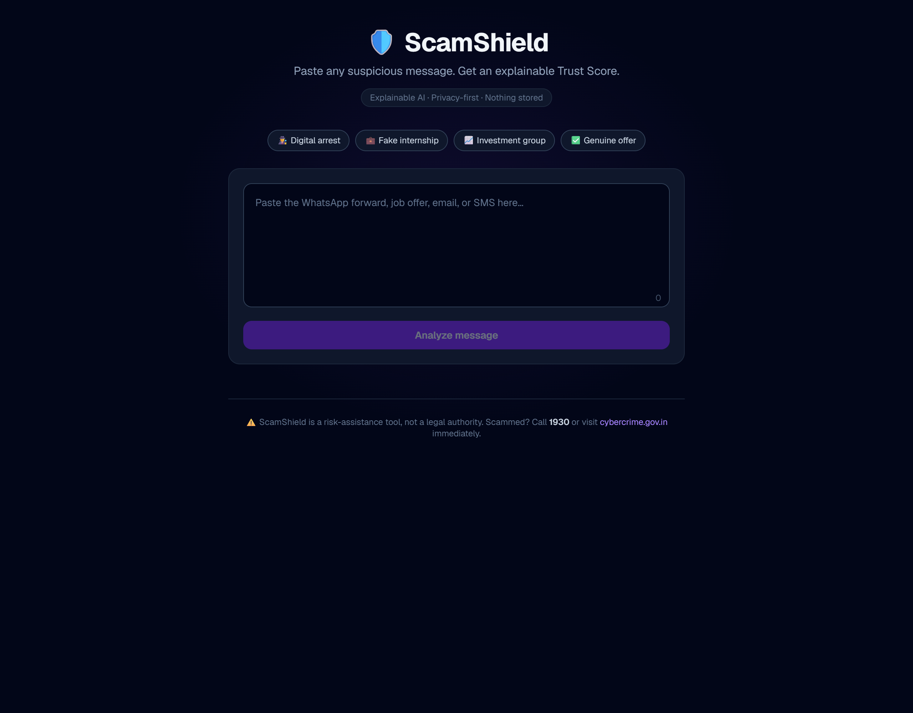
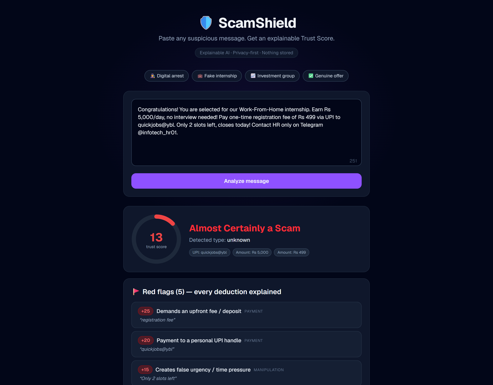
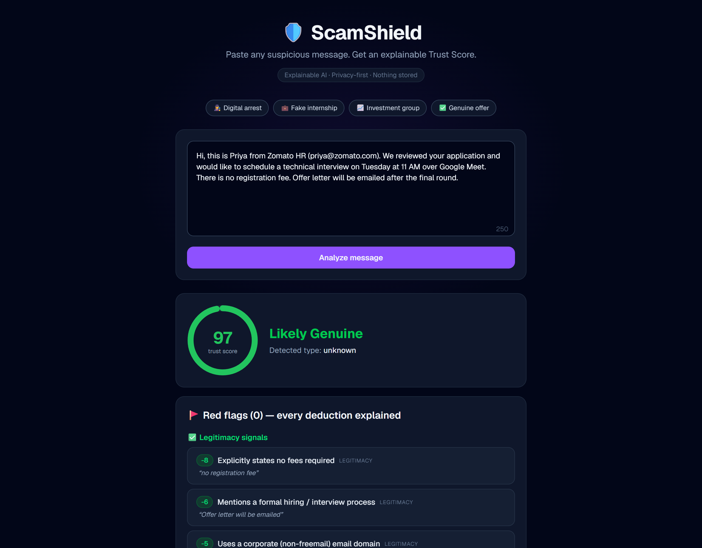
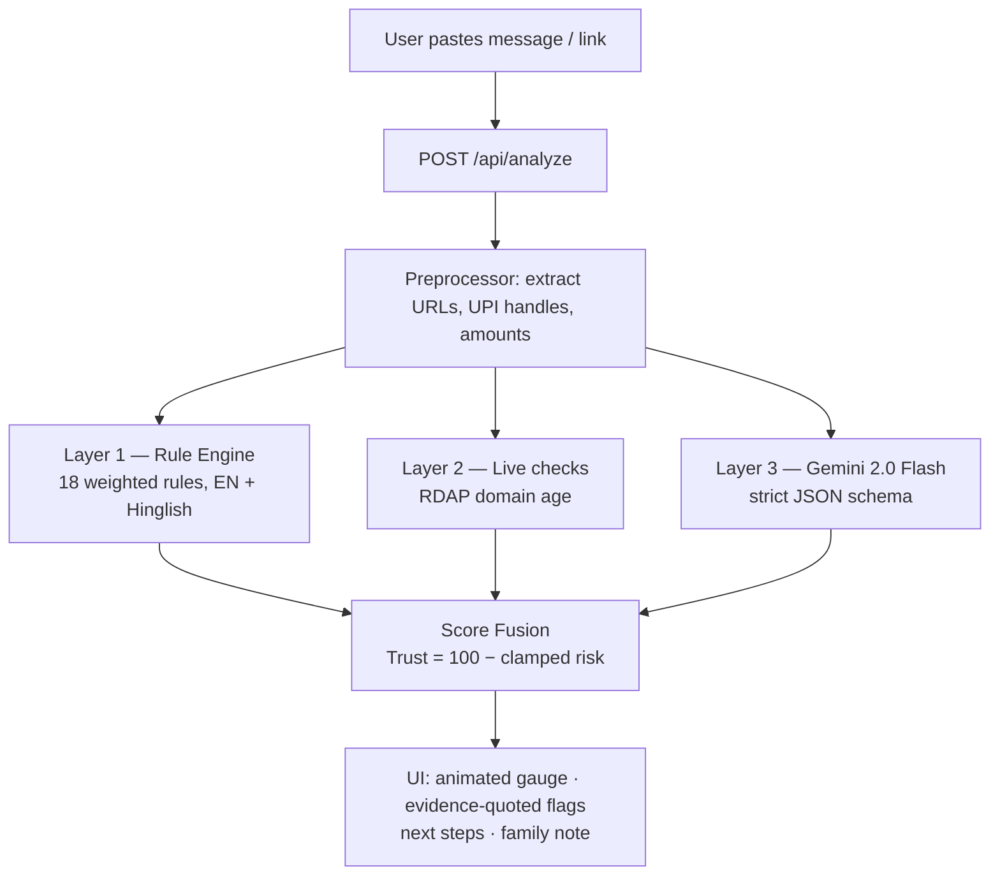

<div align="center">

# 🛡️ ScamShield AI

### Real-time fraud forensics for Indian messaging — deterministic rule engine, live domain intelligence, explainable AI scoring.

Every scam message has a pattern.

> 🎙️ **v2 (HACKDAY 1.0):** Voice-note analysis — upload a WhatsApp .ogg voice note, get transcript + Trust Score.

**Paste any suspicious message → Get a Trust Score with evidence-quoted red flags, scam classification, and a family-friendly Hinglish explainer**

[Live Demo](https://YOUR_VERCEL_URL.vercel.app) · [GitHub Repo](https://github.com/YOUR_USERNAME/scamshield) · [Issues](https://github.com/YOUR_USERNAME/scamshield/issues) · [How It Works](#-how-the-trust-score-works--the-innovation) · [Try the Samples](#-judges-90-second-demo)


</div>

---

## 📖 Contents

[The Problem](#-the-problem) · [Why Existing Tools Fail](#-why-existing-tools-fail) ·
[Our Solution](#-our-solution) · [How the Trust Score Works](#-how-the-trust-score-works--the-innovation) ·
[Scam Taxonomy](#-scam-taxonomy-we-detect) · [Architecture](#️-architecture) ·
[Tech Stack](#️-tech-stack--why) · [Getting Started](#-getting-started) ·
[Judge's 90-Second Demo](#-judges-90-second-demo) · [Roadmap](#️-roadmap) ·
[Evaluation Mapping](#-evaluation-criteria-mapping) · [Sources](#-research-sources)

---

## 🚨 The Problem

> ⚠️ *Statistics as reported in media citing I4C / Government of India data — live sources linked below.*

India is in the middle of its largest cyber-fraud wave:

- 💸 **₹22,000+ crore (~US$2.7B)** lost to cyber fraud in Jan–Nov 2024; complaints on the National Cybercrime Reporting Portal crossed **1 crore** (I4C data, via Reuters).
- 👮 **"Digital arrest" scams** — impersonators posing as CBI/customs/police extorted **₹120+ crore in Q1 2024 alone**; the Prime Minister had to address it on Mann Ki Baat: *"No agency ever conducts a digital arrest."*
- 🎓 **Students are prime targets** — fake internships demanding "registration fees", Telegram-only "HR", and too-good-to-be-true work-from-home pay.
- 🎙️ **AI voice cloning** — seconds of audio are enough; India is among the worst-hit countries (McAfee global survey).

**The cruel part:** every one of these scams arrives as a *message*. The victim is holding the evidence and can't read it — by the time they search "is this a scam?", they've often already paid.

**ScamShield puts a fraud analyst in everyone's pocket — one paste away.**

---

## 🔍 Why Existing Tools Fail

| Tool | Checks | Misses |
|---|---|---|
| Google Safe Browsing / VirusTotal | URL blocklists | Message-level context, zero-day pages, non-URL scams |
| Truecaller | Phone numbers | Text scams, job fraud, digital arrest |
| Bank / UPI warnings | Transactions (too late) | The scam starts hours before the payment |
| Asking a chatbot | Generic, inconsistent | No scoring, no live checks, no explainability, no Hinglish |

**The gap:** no tool does *message-level, India-specific, Hinglish-aware, explainable* scam analysis with **live deterministic verification**. ScamShield is built for the scams hitting Indian inboxes *right now*.

---

## 💡 Our Solution

1. **🧭 Trust Score (0–100)** — one glance tells you if it's safe
2. **🚩 Explainable red flags** — every deduction shown *with the exact evidence quoted from your message*
3. **🧬 Scam-type classification** — digital arrest, fake internship, task scam, investment group, and more
4. **✅ "What to do next"** — concrete steps, incl. reporting via **1930** / cybercrime.gov.in / Chakshu
5. **👨‍👩‍👧 Family mode** — a forwardable, jargon-free Hinglish explainer for parents
6. **🎙️ Voice-note analysis** — upload a WhatsApp .ogg voice note, get transcript + Trust Score







> 🔒 **Privacy-first:** messages are analyzed in memory and **never stored**. No login. No tracking.

---

## 🧠 How the Trust Score Works — *The Innovation*

Most "AI detectors" are just a prompt. ScamShield uses a **hybrid three-layer engine**:

```
Risk = clamp( Σ rule weights + Σ live-check weights + Σ AI weights , 3–100 )
Trust = 100 − Risk
```

| Layer | What it checks | Why |
|---|---|---|
| **1. Rule Engine (18 rules)** | Fees, UPI handles, authority impersonation, urgency, Hinglish keywords | Deterministic, explainable, instant — the backbone |
| **2. Live Checks (RDAP)** | Domain registration age | Catches fresh scam infrastructure the rules can't see |
| **3. Gemini (structured JSON)** | Tone, coercion, vagueness, channel mismatch | Catches semantic tricks rules can't — with a strict schema, no hallucinated free text |
| **🎙️ Voice-note analysis** | Upload a WhatsApp .ogg voice note, get transcript + Trust Score | In-memory multimodal speech-to-text forensics via Gemini `inline_data` |

**Why hybrid beats a pure LLM:** rules guarantee *consistency and explainability*, the LLM adds *semantic understanding*, live checks catch *fresh infrastructure* — and **every single point deduction is shown to the user with evidence**. No black box.

### Sample rules (of 18)

| Signal | Weight | Evidence example |
|---|---|---|
| Upfront fee / "registration fee" | +25 | *"pay ₹499 registration fee"* |
| OTP/PIN/CVV request · remote-control app | +25 | *"share the OTP"*, *"install AnyDesk"* |
| Personal UPI handle | +20 | *"pay to quickjobs@ybl"* |
| Authority impersonation / digital arrest | +20 | *"FIR filed against your Aadhaar"* |
| Urgency · "only 2 slots left" | +15 | *"closes today"* |
| HR only on Telegram/WhatsApp | +15 | *"contact HR only on Telegram"* |
| **No-fee statement · formal interview · corporate email** | **−8/−6/−5** | *legitimacy signals reduce risk* |

### Verdict bands

| Trust Score | Verdict |
|---|---|
| 🟢 75–100 | Likely genuine — standard caution |
| 🟡 50–74 | Suspicious — verify independently |
| 🟠 25–49 | High risk — likely scam, don't pay |
| 🔴 0–24 | Almost certainly a scam — report it |

---

## 🎯 Scam Taxonomy We Detect

Researched from NCRP complaint patterns, government advisories, and media reporting:

| # | Type | Signature we encode |
|---|---|---|
| 1 | Digital Arrest | Authority + video call + urgency + secrecy + payment |
| 2 | Fake Job/Internship | Fee + salary/skill mismatch + Telegram-only HR + no interview |
| 3 | Task/Prepayment | Small real payouts first, then "premium tasks" need deposits |
| 4 | Investment/Trading Group | Guaranteed returns + personal UPI + withdrawal "tax/fee" |
| 5 | KYC/Utility/Courier | Link + authority + deadline ("electricity cut tonight") |
| 6 | UPI Collect Fraud | PIN entered to *receive* money — PIN only ever *pays* |
| 7 | Loan-App Extortion | APK + contact harvesting |
| 8 | AI Voice-Clone Emergency | Urgency + unusual payment request from "family" |
| 9 | Fake Customer Care | Unverified number + remote-app install request |
| 10 | Phishing/APK Delivery | Fake KYC pages, malicious APKs via WhatsApp |

---

## 🏗️ Architecture



> Privacy by design: stateless pipeline — message text and voice notes are analyzed in memory and discarded; nothing is persisted. Audio is transcribed verbatim via Gemini `inline_data` without writing to disk.

---

## 🛠️ Tech Stack — & Why

| Layer | Choice | Why |
|---|---|---|
| Framework | Next.js (App Router) + TypeScript strict | One deploy for UI + API; type-safe contracts |
| Styling | Tailwind CSS | Fast, consistent, dark-theme-first |
| AI | Gemini 2.0 Flash via REST | Free tier, fast, native structured-JSON (responseSchema) — no SDK lock-in |
| Live checks | RDAP (rdap.org) | Free, keyless, authoritative registration data |
| Rules | Pure TypeScript + regex lexicons | Deterministic, unit-testable, zero cost |
| Hosting | Vercel | Live demo link, zero-config |

---

## 🚀 Getting Started

```bash
git clone https://github.com/YOUR_USERNAME/scamshield.git
cd scamshield
npm install
cp .env.example .env.local   # add your GEMINI_API_KEY (free: aistudio.google.com)
npm run dev                   # → http://localhost:3000
```

**Project structure:**

```
├── app/api/analyze/route.ts   # 3-layer fusion pipeline
├── app/page.tsx               # single-page dark UI
├── components/                # ScoreGauge · FlagCard · StepsCard · FamilyNote
├── lib/rules/                 # lexicon (18 rules) · engine
├── lib/checks/                # entity extraction · RDAP domain age
├── lib/ai/gemini.ts           # structured-output client
├── lib/samples.ts             # one-click demo messages
└── samples/                   # sample texts (test corpus)
```

---

## 🧪 Judge's 90-Second Demo

1. **Digital arrest** (Hinglish pressure tactics):
   > "This is Inspector Rajesh Verma, Cyber Cell Mumbai… to avoid digital arrest, transfer ₹2,40,000 to the RBI verification account within 30 minutes. Do not share this with anyone."
   → 🔴 **Trust 20/100** — authority, urgency, secrecy, transfer all flagged with quoted evidence.

2. **Fake internship** (the student scam):
   > "Selected! ₹5,000/day WFH. Pay ₹499 registration fee via UPI to quickjobs@ybl. Only 2 slots left. HR only on Telegram."
   → 🔴 **Trust 13/100** — fee, personal UPI, false urgency, channel mismatch, salary mismatch.

3. **Genuine offer** →
   🟢 **Trust 97/100** with green legitimacy signals (no-fee, formal interview, corporate email).

4. **The live moment:** paste any link from your spam folder → "Domain registered 6 days ago."

*(Try all four instantly with the one-click sample chips on the homepage.)*

---

## 🗺️ Roadmap

- 🧩 **Chrome extension** — overlay Trust Scores on LinkedIn, Naukri, WhatsApp Web
- 💬 **WhatsApp bot** — forward any message, get the score back
- 🎙️ **Live-call analysis** — real-time speech-to-text risk scoring
- 🌏 **Regional languages** — Tamil, Telugu, Bengali, Marathi lexicons
- 📡 **Community Scam Feed** — anonymized trending-pattern radar
- 🔌 **Open API** — for job platforms to pre-screen postings before students ever see them

---

## 🏆 Evaluation Criteria Mapping

### HackDevengers 2.0

| Criterion | ScamShield |
|---|---|
| Innovation & Originality | Hybrid explainable engine vs. black-box AI tools; Hinglish-first |
| Problem-Solving | Acts at the message stage — before payment, where other tools arrive too late |
| Technical Implementation | Weighted rule engine + RDAP integration + schema-constrained LLM fusion |
| Functionality & UX | Deployed, one-paste flow, animated gauge, evidence-quoted flags, zero login |
| Impact & Scalability | Targets India's ₹22,000-cr fraud wave; clear platform roadmap |

### HACKDAY 1.0 — Tech for a Better Tomorrow

| Criterion (weight) | ScamShield |
|---|---|
| Problem & Impact (25%) | The "better tomorrow" where no one loses savings to a text message |
| Technical Implementation (25%) | Three-layer engine, strict contracts, graceful degradation |
| Innovation (20%) | Explainable Trust Score + live domain-age verification |
| User Experience (15%) | One paste → full verdict; family mode for non-tech users |
| Feasibility & Scalability (15%) | 100% free-tier stack; extension/bot/API roadmap |

---

## 😤 Challenges & Learnings

- **LLM inconsistency:** identical messages scored differently across runs → solved with `responseSchema` structured output + deterministic rules as the backbone.
- **Hinglish is its own language:** English lexicons miss "registration fee do" → built a custom Hinglish lexicon.
- **False positives destroy trust:** legitimacy signals (no-fee, formal process, corporate domain) are weighted against risk rules so genuine offers stay green.

---

## 📚 Research Sources

*(Live links verified at submission time.)*

- Reuters — I4C cyber-fraud loss & complaint data, 2024
- Government data tabled in Parliament — digital-arrest losses, Q1 2024
- PM Mann Ki Baat (Oct 2024) — digital-arrest warning
- AICTE/UGC advisories — fake internship/job scams
- McAfee global survey — AI voice-cloning fraud
- NCRP (cybercrime.gov.in) · 1930 helpline · Chakshu portal

---

## ⚠️ Disclaimer

ScamShield is a risk-assistance and educational tool, not a legal authority. A high score is not proof of fraud; a green score is not a guarantee. If you've been scammed, act fast: **call 1930** or report at **cybercrime.gov.in** — contacting your bank within the golden hour maximizes recovery chances.

---

## 👥 Team

YOUR_NAME / TEAM_NAME

---

## 🐛 Issues

Report issues and feature requests: [https://github.com/YOUR_USERNAME/scamshield/issues](https://github.com/YOUR_USERNAME/scamshield/issues)

---

## 🙏 Acknowledgements

Built in 24 hours for HackDevengers 2.0 & HACKDAY 1.0. AI: Google Gemini · Hosting: Vercel.

---

## 📄 License

MIT — see [LICENSE](LICENSE).

<div align="center"><sub>⭐ If ScamShield saves even one person from losing their savings, this was worth building.</sub></div>